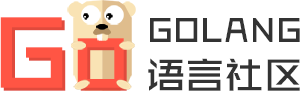

 
<h2 align="center">Golang语言社区 - 资源站</h2>

## 简介

**Golang语言社区**是中国Go爱好者组成的一个完全非赢利的组织。

资源站的目的是给予广大Go爱好者一个更快找寻Go相关资源并提供下载链接的网站。

## 网站模块

- 首页 [http://www.golang.mom/](http://www.golang.mom/)
- Go下载 [http://www.golang.mom/dl](http://www.golang.mom/dl)
- 第三方包 [http://www.golang.mom/pkg](http://www.golang.mom/pkg)
- 开源项目 [http://www.golang.mom/project](http://www.golang.mom/project)
- 工具 [http://www.golang.mom/tool](http://www.golang.mom/tool)

## 目录结构

- web: 资源站完整前端代码
- service: 脚本服务

## 使用技术

- Bootstrap: [https://github.com/twbs/bootstrap](https://github.com/twbs/bootstrap)
- Font-Awesome: [https://github.com/FortAwesome/Font-Awesome](https://github.com/FortAwesome/Font-Awesome)
- Vue.js: [https://github.com/vuejs/vue](https://github.com/vuejs/vue)

## 社区相关

欢迎大家微信扫描二维码关注公众号

